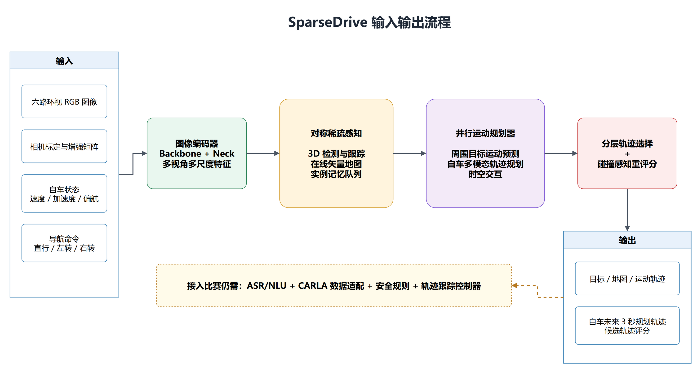
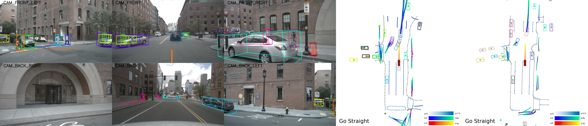
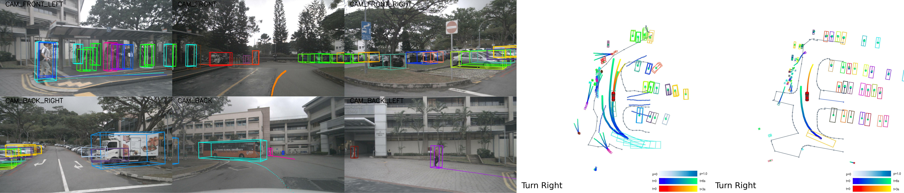
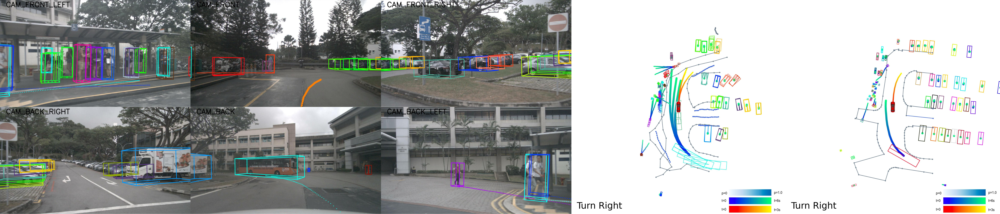
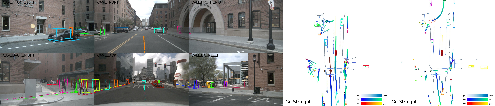
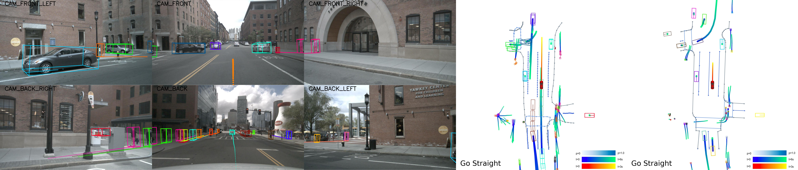
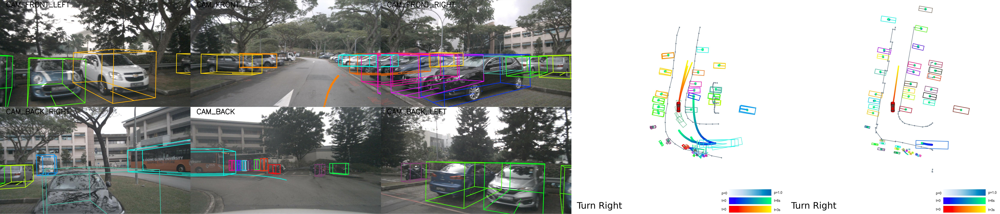

# SparseDrive Baseline 调研与复现实验报告

负责人：刘旭
完成状态：官方 Stage2 权重推理、nuScenes mini 全量评测、性能测试、可视化与案例分析已完成。

## 1. 模型基本介绍

| 项目 | 内容 |
| --- | --- |
| 模型名称 | SparseDrive |
| 论文标题 | *SparseDrive: End-to-End Autonomous Driving via Sparse Scene Representation* |
| 作者 | Wenchao Sun, Xuewu Lin, Yining Shi, Chuang Zhang, Haoran Wu, Sifa Zheng |
| 发表信息 | ICRA 2025 |
| 论文链接 | https://arxiv.org/abs/2405.19620 |
| 官方代码仓库 | https://github.com/swc-17/SparseDrive |
| 开源协议 | MIT |
| 主要任务 | 多视角视觉输入下的 3D 检测、跟踪、在线地图构建、运动预测和自车轨迹规划 |

SparseDrive 是一种以稀疏场景表示为核心的端到端自动驾驶方法。它不构建计算开销较大的稠密 BEV 特征，而是以动态交通参与者实例和静态地图实例为中心组织场景表示，并将检测、跟踪、在线地图、运动预测和规划统一在同一网络中。

模型包含三个关键部分：

1. **图像编码器**：将六路相机图像编码为多尺度图像特征。
2. **对称稀疏感知模块**：以实例特征和几何锚点表示交通参与者及地图元素，同时完成检测、跟踪和在线地图构建；实例记忆队列负责时序建模。
3. **并行运动规划器**：同时预测周围交通参与者和自车的多模态未来轨迹，通过分层轨迹选择与碰撞感知重评分输出最终规划轨迹。

SparseDrive 的主要价值是用统一、稀疏且规划导向的场景表示降低端到端驾驶模型的训练和推理开销，同时保留感知、预测和规划中间结果，便于分析。

## 2. 输入输出流程



可编辑 Draw.io 源文件：[sparsedrive_pipeline.drawio](assets/sparsedrive_pipeline.drawio)。

### 输入

- 六路环视 RGB 图像。
- 相机内外参及图像增强矩阵。
- 自车状态，包括速度、加速度和偏航角速度等。
- 导航驾驶命令，如直行、左转或右转。
- 历史帧实例记忆。

### 输出

- 3D 目标检测与多目标跟踪结果。
- 在线矢量地图元素。
- 周围车辆和行人的多模态运动轨迹。
- 自车未来 3 秒规划轨迹及候选轨迹评分。

模型不接收自然语言或语音，也不直接输出油门、制动和转向控制量。若接入本项目，仍需增加 ASR/NLU、语言指令到导航条件的映射、CARLA 适配和轨迹跟踪控制器。

## 3. 环境与算力需求

### 3.1 官方依赖与数据

- Python 3.8。
- PyTorch 1.13.0 + CUDA 11.6。
- MMCV-Full 1.7.1、MMDetection 2.28.2。
- FlashAttention 2.3.2。
- nuScenes-devkit 1.1.10。
- 自定义 `deformable_aggregation` CUDA 算子。
- nuScenes 数据集、CAN bus 扩展和地图扩展文件。

本次实际环境详见 `experiments/sparsedrive/environment.txt`。

### 3.2 官方训练成本

论文实验使用 8 张 NVIDIA RTX 4090 24 GB：

| 模型 | 骨干网络 | 输入尺寸 | 单卡训练显存 | 单卡 batch size | 两阶段训练时间 | 参数量 | FLOPs |
| --- | --- | ---: | ---: | ---: | ---: | ---: | ---: |
| SparseDrive-S | ResNet-50 | 256 x 704 | 15.2 GB | 6 | 18 h + 2 h | 85.9 M | 192 G |
| SparseDrive-B | ResNet-101 | 512 x 1408 | 17.6 GB | 4 | 26 h + 4 h | 104.7 M | 787 G |

本任务只复现预训练权重推理，不重新训练。若后续训练，建议按官方配置使用 8 张 24 GB GPU；单卡训练需要重新调整 batch size、学习率和训练时长。

### 3.3 本次推理环境与成本

| 项目 | 实测结果 |
| --- | --- |
| GPU | NVIDIA GeForce RTX 4090 D 24 GB，单卡 |
| CPU / 内存 | 16 核 / 80 GB |
| Python | 3.8.20 |
| PyTorch | 1.13.0+cu116 |
| MMCV / MMDetection | 1.7.1 / 2.28.2 |
| FlashAttention | 2.3.2 |
| 权重大小 | 约 986 MB |
| PyTorch 峰值显存 | 3942 MiB |
| `nvidia-smi` 采样峰值显存 | 4157 MiB |
| FPS | 5.9 |
| 等效单帧延时 | 169.49 ms |

本次脚本记录到 PyTorch 峰值分配显存 3942 MiB，`nvidia-smi` 记录到进程峰值占用 4157 MiB，可将约 4.1 GiB 视为当前复现流程的保守部署上界。需要注意，官方 `benchmark.py` 在同一进程中先执行 FLOPs 统计和多次前向，再读取进程启动以来的 `torch.cuda.max_memory_allocated()`，中间未重置峰值统计，因此 3942 MiB 并非与论文严格同口径的纯推理显存。官方论文报告 SparseDrive-S 为 9.0 FPS、1294 MB 推理显存；差异还受到 RTX 4090 与 4090 D、CUDA/自定义算子编译环境及计时范围影响。若要严格复测，应在模型加载和预热后调用 `torch.cuda.reset_peak_memory_stats()`，再单独统计稳定推理阶段。工程部署仍建议至少使用 8 GB 显存，并为输入缓存和其他模块预留余量。

## 4. 实验结果记录

### 4.1 数据集与设置

- 数据集：nuScenes v1.0-mini。
- 场景数：10，其中训练场景 8、验证场景 2。
- 总样本数：404，其中训练样本 323、验证样本 81。
- 有效规划样本：69。
- 模型：SparseDrive Stage2 官方预训练权重。
- 评测方式：nuScenes 离线开环评测，不包含 CARLA 闭环车辆控制。
- 性能测试：81 个验证样本，单卡 batch size 为 1。

### 4.2 主要指标

| 类别 | 指标 | 结果 |
| --- | --- | ---: |
| 3D 感知 | mAP | 0.4249 |
| 3D 感知 | NDS | 0.4811 |
| 3D 感知 | mATE / mASE / mAOE | 0.6033 / 0.4518 / 0.5643 |
| 跟踪 | AMOTA / AMOTP | 0.5649 / 0.9584 |
| 跟踪 | MOTA / MOTP | 0.5832 / 0.5452 |
| 跟踪 | Recall / IDS | 0.6535 / 79 |
| 在线地图 | mAP | 0.7741 |
| 车辆运动预测 | EPA / minADE / minFDE | 0.6095 / 0.3367 / 0.4646 |
| 行人运动预测 | EPA / minADE / minFDE | 0.4958 / 0.7320 / 1.0765 |
| 自车规划 | 平均 L2 误差 | 0.7612 m |
| 自车规划 | 官方 `obj_box_col` 碰撞率 | 0.242% |
| 推理性能 | FPS | 5.9 |
| 推理性能 | 等效单帧延时 | 169.49 ms |
| 推理性能 | PyTorch 峰值显存 | 3942 MiB |

其中，等效单帧延时由 `1000 / FPS` 换算，代表整体吞吐量，不等同于仅统计模型前向过程的 CUDA Event 延时。碰撞率使用项目评测器的官方 `obj_box_col` 口径。

受 mini 数据规模和本地评测环境影响，本次结果用于验证部署可行性、模型功能与推理成本；与论文完整 nuScenes 验证集结果对比时，应以官方报告为主。

### 4.3 与比赛性能要求对照

比赛基础赛道的核心性能要求为：

- 语音指令识别准确率不低于 95%。
- 指令解析延时不高于 50 ms。
- 决策响应全流程延时不高于 150 ms。
- 场景任务完成率不低于 90%，且无碰撞、无违规、指令响应无遗漏。

| 比赛指标 | 达标要求 | SparseDrive 本次结果 | 判断 |
| --- | ---: | ---: | --- |
| 语音指令识别准确率 | >= 95% | 不包含 ASR 模块 | 未覆盖 |
| 指令解析延时 | <= 50 ms | 不包含 NLU 模块 | 未覆盖 |
| 决策响应全流程延时 | <= 150 ms | 模型吞吐量等效延时 169.49 ms，且未包含 ASR/NLU 与控制 | 当前不达标 |
| 场景任务完成率 | >= 90% | nuScenes 开环评测，未运行 CARLA 闭环任务 | 未覆盖 |
| 碰撞与违规 | 无碰撞、无违规 | 开环官方碰撞率 0.242%；未统计 CARLA 违规 | 不能替代闭环达标结论 |
| 指令响应遗漏 | 无遗漏 | 仅使用离散导航命令 | 未覆盖 |

因此，SparseDrive 当前只能回答视觉感知、预测、规划精度和模型推理成本问题，不能单独证明参赛系统达到基础赛道门槛。后续必须在 CARLA 闭环中联合 ASR/NLU、风险判断和车辆控制模块重新统计上述四项核心指标。

### 4.4 典型成功案例

#### 案例 21：城市道路直行



- 输入：六路环视图像、自车状态和直行导航命令；道路两侧存在停放车辆和道路设施。
- 输出：保持直行的未来轨迹，规划 L2 误差 0.1416 m，无预测碰撞。
- 成功原因：车道方向和道路边界清晰，模型正确区分静态车辆与可行驶区域，预测轨迹与真实轨迹在 3 秒范围内保持接近。

#### 案例 48：园区道路右转



- 输入：六路环视图像、自车状态和右转命令；道路两侧有车辆和行人。
- 输出：平滑右转轨迹，规划 L2 误差 0.1385 m，无预测碰撞。
- 成功原因：模型恢复了弯道路形，转向曲率和纵向推进量与真实轨迹一致。

#### 案例 49：连续帧稳定右转



- 输入：案例 48 的相邻连续帧，导航命令仍为右转。
- 输出：规划 L2 误差 0.1073 m，无预测碰撞。
- 成功原因：实例记忆维持了连续帧中的目标和地图信息，规划方向与轨迹形状保持稳定。

### 4.5 典型失败案例

#### 案例 10：直行速度高估



- 输入：接近路口的城市直行道路，路侧车辆较多，导航命令为直行。
- 输出：规划 L2 误差 3.1149 m，在 3.0 秒处触发预测碰撞。
- 失败原因：预测纵向距离约 25.73 m，真实轨迹约 13.58 m。模型对未来速度估计过高，长时域轨迹明显前冲。

#### 案例 11：纵向误差随时域累积



- 输入：案例 10 的相邻城市道路帧，导航命令为直行。
- 输出：规划 L2 误差 3.3790 m，在 3.0 秒处触发预测碰撞。
- 失败原因：短时方向正确，但纵向速度持续高估；3 秒预测距离约 21.51 m，真实轨迹约 10.42 m，误差随预测时域快速放大。

#### 案例 59：密集停车区右转偏差



- 输入：两侧停放车辆密集的园区弯道，导航命令为右转。
- 输出：规划 L2 误差 0.8767 m，在 3.0 秒处触发预测碰撞。
- 失败原因：模型识别了右转意图，但横向转向幅度逐步大于真实轨迹；狭窄可行驶空间内的横向偏差导致规划轨迹与未来目标框相交。

完整指标和案例记录见 `experiments/sparsedrive/metrics.csv` 与 `experiments/sparsedrive/selected_cases.csv`。

## 5. 不足与改进方向

### 5.1 与比赛目标之间的缺口

1. **缺少语言和语音输入**：SparseDrive 只接收视觉、自车状态和离散导航命令，不能解析模糊、组合式自然语言指令。
2. **缺少 CARLA 闭环接口**：官方实现面向 nuScenes 离线开环评测，不直接生成 CARLA 的油门、制动和转向控制。
3. **实时性仍需优化**：本次实测等效延时为 169.49 ms，高于赛题端到端决策响应 150 ms 的目标；该数值尚未包含 ASR 和语言解析。
4. **长时域速度估计不稳定**：失败案例表明纵向速度高估会快速放大 2 至 3 秒规划误差。
5. **安全约束依赖感知质量**：碰撞感知重评分建立在目标检测和运动预测结果上，漏检或轨迹预测偏差会传递到规划。
6. **工程依赖较旧且安装复杂**：PyTorch 1.13、MMCV 1.x、FlashAttention 和自定义 CUDA 算子之间存在严格版本约束。

### 5.2 建议改进

1. 将语音经 ASR/NLU 转换为结构化指令，例如目标速度、目标车道、转向意图和安全约束，再作为 ego query 或规划条件注入。
2. 增加 CARLA 数据适配层，将多视角相机、车辆状态和地图信息转换为模型输入，并用 PID/MPC 将规划轨迹转换为车辆控制。
3. 在模型规划结果之后增加 TTC、道路边界和动态安全距离检查，保留紧急制动等规则安全兜底。
4. 针对失败案例增加速度变化、红绿灯、前车制动和窄路会车数据，强化长时域速度预测与横向安全裕度。
5. 使用 TensorRT、FP16/INT8、算子融合和异步数据预处理降低延时；优先优化图像骨干和自定义聚合算子。
6. 在 CARLA 中补充闭环指标，包括任务完成率、碰撞次数、压线、闯红灯、超速、舒适性及指令响应遗漏率。

## 6. 对自研方案的启发

SparseDrive 不适合直接承担比赛要求的完整语音驾驶链路，但以下设计可以迁移到自研方案：

1. **稀疏场景中间表示**：将车辆、行人、车道边界、路口和施工区域表示为对象级 token，降低大模型处理原始视觉特征的成本。
2. **语言条件化 ego 实例**：把结构化语音意图写入 ego token，使“右转、减速、变道”等命令直接影响候选轨迹生成和评分。
3. **预测与规划并行交互**：同时建模周围参与者和自车未来行为，避免先预测、后规划造成的信息割裂。
4. **分层候选轨迹选择**：先按导航意图筛选，再按运动合理性和碰撞风险重评分，适合与规则风险模块结合。
5. **时序实例记忆**：保留关键对象和风险状态，帮助处理组合指令及“先减速、确认安全、再变道”等多阶段任务。
6. **学习规划加规则兜底**：SparseDrive 负责视觉场景表征和候选轨迹，规则模块负责硬安全约束，CARLA 控制器负责稳定执行。

建议的自研组合为：

```text
语音 -> ASR/NLU -> 结构化驾驶意图
     -> CARLA 多视角视觉与车辆状态
     -> 稀疏对象/地图表示
     -> 条件化预测与候选轨迹规划
     -> TTC/碰撞/道路规则安全检查
     -> PID/MPC 轨迹跟踪与车辆控制
```

## 7. 总体评价

### 7.1 是否继续深入复现

**建议继续有限度深入复现。**

下一阶段应优先完成 CARLA 输入适配、规划轨迹到车辆控制的闭环接入，并在基础操控、复杂避障和应急响应场景中测试。若上述接口能够跑通，再考虑完整 nuScenes 验证集或模型微调；现阶段不建议投入多卡资源从头训练。

### 7.2 是否作为正式 baseline

**不建议将 SparseDrive 直接作为整套参赛系统的唯一正式 baseline；建议将其作为视觉端到端感知-预测-规划 baseline 和自研规划模块的重要参考。**

原因是 SparseDrive 的稀疏表示、并行预测规划和碰撞重评分具有明确参考价值，推理显存也可接受；但其缺少语音理解、CARLA 闭环控制和比赛要求的多模态语义对齐接口，无法单独覆盖完整赛题。

正式系统 baseline 更适合采用：

```text
ASR/NLU + CARLA 真值/视觉感知 + 风险规则 + BehaviorAgent/PID
```

在该可运行闭环之上，再逐步引入 SparseDrive 风格的稀疏视觉表示和学习式规划器，用于提升复杂场景决策质量。

### 7.3 总结

SparseDrive 已成功完成本地部署和预训练权重推理，覆盖了感知、跟踪、地图、预测和规划评测。实测规划 L2 为 0.7612 m、官方碰撞率为 0.242%、速度为 5.9 FPS、峰值显存约 4.1 GiB。它证明了稀疏场景表示在端到端驾驶中的效率潜力，也暴露出语言接口缺失、开环到闭环迁移和长时域速度误差等问题。对本项目而言，其最佳定位是规划技术 baseline 与架构参考，而不是直接替代完整语音控制系统。

## 8. 参考资料

- SparseDrive 论文：https://arxiv.org/abs/2405.19620
- SparseDrive 官方仓库：https://github.com/swc-17/SparseDrive
- nuScenes：https://www.nuscenes.org/
- 本项目整体规划：`program/plan.pdf`
- baseline 任务分工：`program/task_0607.pdf`
