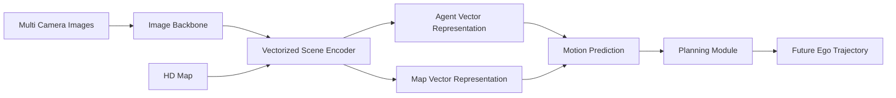

# VAD（Vectorized Autonomous Driving）模型研究

负责人：王皓然
当前状态：基础资料整理完成；环境配置、模型运行、复现实验结果待补充。

---

# 1. 调研目标

本调研面向“智能驾驶场景算法基础研究”方向，目标是分析 **VAD（Vectorized Autonomous Driving）** 是否适合作为自动驾驶规划与决策方向的 baseline 或技术参考。

本阶段主要整理 VAD 官方论文、代码仓库和公开文档中已有信息，不填写尚未完成的训练、测试和评测结果。

重点关注：

* VAD 的整体架构设计
* 向量化自动驾驶表示方法
* 感知、预测、规划任务之间的关系
* 与 CARLA / 仿真驾驶任务结合的可能性
* 作为项目 baseline 的可行性

---

# 2. 基本信息

| 项目          | 内容                                                                    |
| ----------- | --------------------------------------------------------------------- |
| 模型名称        | VAD（Vectorized Autonomous Driving）                                    |
| 论文标题        | VAD: Vectorized Scene Representation for Efficient Autonomous Driving |
| 论文链接        | [https://arxiv.org/abs/2303.12077](https://arxiv.org/abs/2303.12077)  |
| 官方仓库        | [https://github.com/hustvl/VAD](https://github.com/hustvl/VAD)        |
| 发布机构        | HUST-VL                                                               |
| 任务类型        | 自动驾驶感知、预测、规划、多任务决策                                                    |
| 核心思想        | 使用向量化场景表示统一建模车辆、地图、轨迹和规划任务                                            |
| 数据来源        | nuScenes                                                              |
| baseline 方向 | BEV-based 自动驾驶规划模型                                                    |
| 主要应用        | 自动驾驶端到端感知与规划                                                          |

---

# 3. VAD 核心介绍

传统自动驾驶系统通常采用：

```text
感知
 ↓
目标检测
 ↓
轨迹预测
 ↓
规划
 ↓
控制
```

的串联结构。

VAD 的核心思想是：

> 使用 Vectorized Scene Representation（向量化场景表示）替代传统 dense BEV feature，让模型直接处理车辆、道路结构和交通参与者的向量信息。

VAD 不直接依赖：

* 像素级 BEV feature
* 大量 rasterized map

而是构建：

* agent vector
* map vector
* trajectory vector

等结构化表示。

---

VAD 主要解决：

1. 如何高效表示驾驶场景

2. 如何统一感知和规划任务

3. 如何减少 BEV dense feature 的计算量

4. 如何实现更强的可解释规划能力

---

# 4. VAD 与传统自动驾驶模型关系

| 模型        | 表示方式                  | 特点           |
| --------- | --------------------- | ------------ |
| BEVFormer | BEV feature           | 从图像生成 BEV 表示 |
| PETR      | 3D query              | 空间特征学习       |
| UniAD     | BEV feature + 多任务     | 感知预测规划统一     |
| VAD       | Vector representation | 显式建模道路和目标关系  |

---

VAD 与本项目关系：

| 本项目模块 | VAD 可参考内容                      |
| ----- | ------------------------------ |
| 环境感知  | 多摄像头输入和 3D 场景理解                |
| 场景表示  | 向量化道路、车辆、障碍物表示                 |
| 风险判断  | agent trajectory prediction    |
| 行为规划  | planning trajectory prediction |
| 控制执行  | VAD 不直接负责，需要额外控制器              |

---

# 5. VAD 输入输出流程

VAD 官方流程可以概括为：



---

具体输入：

* 多视角 camera images
* HD Map
* ego vehicle state
* 历史轨迹信息

输出：

* 周围目标轨迹预测
* ego future trajectory
* planning trajectory

---

# 6. VAD 核心模块分析

## 6.1 Vectorized Scene Representation

VAD 最大特点：

将驾驶环境表示为：

```text
Scene
 |
 |-- Agent vectors
 |      |
 |      └── vehicles / pedestrians
 |
 |-- Map vectors
        |
        └── lanes / boundaries
```

相比传统 BEV：

优势：

* 数据结构更加紧凑
* 保留几何关系
* 更适合 Transformer 建模

---

## 6.2 Motion Prediction

VAD 对周围交通参与者进行未来轨迹预测。

输入：

```text
agent history
+
scene context
```

输出：

```text
future trajectories
```

用于：

* 风险判断
* 规划决策

---

## 6.3 Planning Head

VAD 最终预测：

ego vehicle future trajectory。

例如：

```text
t0
 |
 |
 ↓

(x1,y1)
(x2,y2)
...
(xN,yN)
```

作为车辆未来运动路径。

---

# 7. 官方数据与格式

VAD 使用：

nuScenes 数据集。

主要包含：

* 多摄像头图像
* LiDAR
* HD Map
* 车辆状态
* 轨迹标注

VAD 不直接使用 mmdetection3d 默认 annotation。

官方需要生成：

```text
vad_nuscenes_infos_temporal_train.pkl

vad_nuscenes_infos_temporal_val.pkl
```

生成方式：

```bash
python tools/data_converter/vad_nuscenes_converter.py \
nuscenes \
--root-path ./data/nuscenes \
--out-dir ./data/nuscenes \
--extra-tag vad_nuscenes \
--version v1.0 \
--canbus ./data
```

---

# 8. 官方 baseline 与运行流程

VAD 官方代码流程：

```text
准备环境
 ↓
准备 nuScenes 数据
 ↓
准备 CAN bus 数据
 ↓
生成 VAD annotation
 ↓
加载 checkpoint
 ↓
进行 inference / evaluation
 ↓
计算规划指标
```

---

主要评测指标：

| 类别                | 指标             |
| ----------------- | -------------- |
| Detection         | mAP            |
| Tracking          | AMOTA          |
| Motion Prediction | minADE         |
| Planning          | L2 error       |
| Planning          | Collision rate |

---

# 9. 环境与算力需求

官方环境：

| 项目        | 要求            |
| --------- | ------------- |
| Python    | 3.8           |
| PyTorch   | 官方配置          |
| CUDA      | GPU 环境        |
| 数据集       | nuScenes      |
| Framework | MMDetection3D |

---

根据官方实验：

训练通常需要多 GPU 环境。

当前测试环境：

| 项目         | 信息             |
| ---------- | -------------- |
| GPU        | RTX4060 Laptop |
| 显存         | 8GB            |
| CUDA       | 13.2           |
| Python     | 3.7            |
| 数据         | nuScenes mini  |
| checkpoint | VAD-Tiny       |

---

当前判断：

完整训练 VAD：

不适合当前设备

原因：

* 显存不足
* nuScenes full 数据规模较大
* 官方训练配置针对多卡环境
之后目标：
* 使用官方 checkpoint
* 使用 mini 数据验证 inference

---

# 10. 指标与实验记录

后续实验记录：

| 类别   | 内容                   |
| ---- | -------------------- |
| 数据集  | nuScenes mini / full |
| 模型   | VAD-Tiny             |
| 输入   | 多视角图像 + 地图           |
| 输出   | ego trajectory       |
| GPU  | RTX4060              |
| 推理时间 | 待测试                  |
| 显存占用 | 待测试                  |
| 成功案例 | 待补充                  |
| 失败案例 | 待补充                  |

---

# 11. 典型案例记录模板

## 成功案例

数据来源：

```
nuScenes mini
```

输入：

```
multi-camera scene
```

模型输出：

```
future ego trajectory
```

成功原因：

```
待补充
```

对项目启发：

```
待补充
```

---

## 失败案例

数据来源：

```
待补充
```

问题：

```
待补充
```

失败原因：

```
待补充
```

---

# 12. 初步不足与风险

基于官方资料，VAD 存在以下限制：

## 1. 不是真正闭环控制系统

VAD 输出：

```text
future trajectory
```

而不是：

```text
steering
throttle
brake
```

因此需要额外：

* controller
* vehicle dynamics model

---

## 2. 强依赖数据集

VAD 针对：

* nuScenes
* 真实道路

设计。

迁移到 CARLA：

需要：

* 数据转换
* sensor adaptation

---

## 3. 训练成本较高

完整复现论文结果：

需要：

* 大 GPU
* full nuScenes
* 长时间训练

---

# 13. 对本项目的启发

VAD 对项目主要提供三个方向：

---

## （1）向量化场景表示

可以将：

```text
车辆
行人
车道
障碍物
```

表示为：

```text
vector entities
```

方便：

* 风险判断
* 规划

---

## （2）预测辅助决策

借鉴：

```text
预测其他车辆未来轨迹
↓
判断风险
↓
规划动作
```

---

## （3）规划模块设计

VAD 可以作为：

```text
感知
 +
预测
 +
轨迹规划
```

模块参考。

---

推荐项目路线：

第一阶段：

```text
CARLA
+
真值感知
+
规则风险判断
+
BehaviorAgent/PID
```

第二阶段：

加入：

```text
VAD 风格 vector scene representation
+
trajectory prediction
+
learning-based planner
```

---

# 14. 是否继续深入复现

当前判断：

建议继续进行 **最小复现实验**。

优先级：

1. 完成 VAD 环境配置

2. 使用 nuScenes mini 测试数据读取

3. 加载 VAD-Tiny checkpoint

4. 完成 inference

5. 分析输出 trajectory

不建议：

* 在 RTX4060 上重新训练 VAD
* 下载完整 nuScenes 做训练复现

---

# 15. 参考资料

VAD Paper:

[https://arxiv.org/abs/2303.12077](https://arxiv.org/abs/2303.12077)

Official Repository:

[https://github.com/hustvl/VAD](https://github.com/hustvl/VAD)

nuScenes Dataset:

[https://www.nuscenes.org/](https://www.nuscenes.org/)

MMDetection3D:

[https://github.com/open-mmlab/mmdetection3d](https://github.com/open-mmlab/mmdetection3d)

---

**最终定位：**

VAD 更适合作为：

> 自动驾驶感知-预测-规划模型 baseline

而不是：

> CARLA 直接车辆控制 agent。

对于本项目，推荐将 VAD 作为：

```text
场景理解 + 轨迹预测 + 高层规划参考模块
```

结合 CARLA 控制器完成闭环驾驶。
