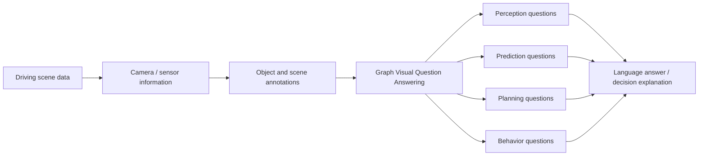

# DriveLM / DriveLM-CARLA Baseline Research

负责人：朱善哲、黄皓星  
当前状态：基础资料整理完成；复现实验、环境实测、结果分析待补充。

## 1. 调研目标

本调研面向“智能驾驶场景的大模型应用”基础赛道，目标是判断 DriveLM / DriveLM-CARLA 是否适合作为本项目的 baseline 或设计参考。

本阶段只整理官方文档、论文和代码仓库中已经明确的信息，不填写任何尚未运行的复现实验结果。

## 2. 基本信息

| 项目 | 内容 |
| --- | --- |
| 模型 / 基准名称 | DriveLM / DriveLM-CARLA |
| 论文标题 | Driving with Graph Visual Question Answering |
| 论文链接 | https://arxiv.org/abs/2312.14150 |
| 官方仓库 | https://github.com/OpenDriveLab/DriveLM |
| 官方项目页 | https://opendrivelab.com/DriveLM/ |
| 任务类型 | 自动驾驶场景理解、视觉问答、驾驶推理、规划决策解释 |
| 核心思想 | 将自动驾驶场景中的感知、预测、规划、行为决策组织为 Graph Visual Question Answering (GVQA) |
| 数据来源 | nuScenes、CARLA |
| baseline 方向 | DriveLM-Agent，基于语言模型的驾驶问答 / 推理 agent |

## 3. DriveLM 核心介绍

DriveLM 将自动驾驶任务拆解为一组与场景对象、状态、风险和行为相关的问题，并通过图结构组织这些问题之间的依赖关系。与只输出轨迹或控制量的端到端规划模型不同，DriveLM 更强调可解释的推理过程：模型需要回答“场景中有什么”“目标对象在哪里”“未来可能发生什么”“自车应该如何行动”等问题。

官方资料中，DriveLM 的主要组成包括：

- DriveLM-Data：面向驾驶场景的图式视觉问答数据。
- DriveLM-Agent：官方提供的 baseline agent，用于在 DriveLM 数据和评测协议上进行训练、推理和提交。
- DriveLM Challenge：围绕自动驾驶场景问答与推理的评测流程。

## 4. DriveLM 与 DriveLM-CARLA 的关系

| 项目 | DriveLM-nuScenes | DriveLM-CARLA |
| --- | --- | --- |
| 数据来源 | nuScenes 真实道路数据 | CARLA 仿真环境 |
| 场景特点 | 多传感器真实驾驶场景 | 可控、可生成、可复现场景 |
| 主要用途 | 真实场景理解与推理评测 | 仿真驾驶场景问答、规划和闭环研究参考 |
| 对本项目价值 | 借鉴多视角场景理解、语言推理和评测方式 | 更接近本项目 CARLA 基础赛道，可作为仿真数据和任务设计参考 |

对本项目而言，DriveLM-CARLA 更贴近“CARLA + 大模型 + 驾驶决策”的研究方向，但官方 baseline 的重点仍是问答 / 推理评测，并不等同于可以直接控制 CARLA 车辆的完整闭环系统。因此，它更适合作为语义理解、风险解释、决策理由生成和评估设计参考。

## 5. 输入输出流程

DriveLM 的官方任务可以概括为：



与本项目规划中的闭环流程对应关系如下：

| 本项目模块 | DriveLM 可参考内容 |
| --- | --- |
| 文本 / 语音指令解析 | 借鉴语言问题设计与结构化问答格式 |
| CARLA 场景信息获取 | 借鉴 DriveLM-CARLA 的仿真场景组织方式 |
| 多模态语义对齐 | 借鉴对象、场景、问题之间的图式关联 |
| 风险判断 | 借鉴问答中对危险对象、未来行为和自车动作的解释 |
| 决策规划 | 借鉴规划类问题的高层决策表达 |
| 车辆控制 | DriveLM 不是直接控制模块，需要本项目自行实现 |

## 6. 官方数据与格式要点

官方数据围绕场景、关键帧、对象信息和问答对组织。根据官方文档，数据中通常包含：

- scene token / sample token 等场景索引。
- 多视角图像路径或传感器信息。
- key frames 和 key object infos。
- 问答内容，覆盖 perception、prediction、planning、behavior 等类型。
- 训练、验证和测试阶段对应的数据划分。

DriveLM 的关键价值不只在数据本身，而在于它把驾驶任务拆成可监督、可解释、可评估的问题链。这一点适合迁移到本项目的“语义对齐 + 风险判断 + 决策规划”模块。

## 7. 官方 baseline 与评测流程

官方 challenge 文档给出的流程包含以下部分：

1. 准备 demo data 或完整数据。
2. 将原始数据转换成 DriveLM challenge 使用的数据格式。
3. 将数据进一步转换为 LLaMA / llama-adapter 训练格式。
4. 训练或加载 baseline。
5. 执行推理，生成预测结果。
6. 按官方评测脚本计算指标或提交评测。

官方 baseline 侧重问答结果生成与评测，不是面向 CARLA 的直接油门、刹车、转向控制器。若要接入本项目，需要在 DriveLM 的“高层语义答案 / 决策解释”和 CARLA 控制模块之间增加规则映射、风险约束和车辆控制逻辑。

## 8. 环境与算力需求

根据官方 challenge README，baseline 示例环境包括：

- Python 3.8。
- PyTorch / CUDA 环境。
- llama-adapter v2 相关依赖。
- LLaMA 权重或兼容语言模型权重。
- DriveLM challenge 数据或 demo data。

官方文档中还提到 baseline 训练和推理会占用较高 GPU 显存。是否能在当前 AutoDL 服务器完整运行，需要后续实际检查显卡型号、CUDA、磁盘空间和权重 / 数据可用性。

待补充：

- AutoDL GPU 型号：
- CUDA 版本：
- Python / conda 环境：
- 可用显存：
- 可用磁盘：
- 是否下载完整数据：
- 是否下载模型权重：

## 9. 指标与实验结果记录项

官方 DriveLM challenge 涉及问答正确性、语言质量和综合得分等评估维度。结合本项目任务，后续记录建议包含：

| 类别 | 记录内容 |
| --- | --- |
| 数据集 | demo data / DriveLM-nuScenes / DriveLM-CARLA |
| 输入 | 场景、图像、多视角信息、问题 |
| 输出 | 模型回答、规划建议、行为解释 |
| 官方指标 | 按官方脚本输出记录 |
| 本项目关注指标 | 是否能转成结构化意图、是否能支持风险判断、是否能辅助 CARLA 决策 |
| 延时 | 单样本推理时间 |
| 显存 | 训练 / 推理峰值显存 |
| 失败案例 | 错误对象、错误风险判断、错误规划建议、幻觉解释 |

当前尚未运行复现实验，因此本节不填写具体数值。

## 10. 典型成功 / 失败案例记录模板

### 成功案例

- 数据来源：
- 输入场景：
- 输入问题：
- 模型输出：
- 正确答案 / 参考答案：
- 成功原因分析：
- 对本项目启发：

### 失败案例

- 数据来源：
- 输入场景：
- 输入问题：
- 模型输出：
- 正确答案 / 参考答案：
- 失败类型：
- 失败原因分析：
- 后续改进方向：

## 11. 初步不足与风险

基于官方文档和项目目标，DriveLM / DriveLM-CARLA 作为 baseline 存在以下注意点：

- 官方 baseline 偏向图式问答和语言推理，不是完整的 CARLA 闭环驾驶控制系统。
- 完整复现可能依赖较大的数据、模型权重和 GPU 显存。
- 输出通常是自然语言答案或问答结果，需要额外设计结构化解析与控制映射。
- 若本项目比赛重点是基础操控、避障和应急响应，短期更稳妥的主线仍是 CARLA 真值感知 + 规则决策 + BehaviorAgent / PID 控制。
- DriveLM 更适合作为高层语义理解和决策解释模块参考，而不是第一阶段直接替代控制器。

## 12. 对本项目的启发

后续自研方案可以借鉴 DriveLM 的三个方向：

1. 用问题链组织驾驶推理：先问“场景中有什么”，再问“危险在哪里”，最后问“自车应该怎么做”。
2. 用图结构连接对象、风险和行为：将前车、行人、车道、路口等对象与可执行动作建立关系。
3. 用语言解释辅助调试：即使最终控制由规则或 agent 完成，也可以让大模型输出决策原因，方便展示和报告。

建议本项目第一版不要直接复刻 DriveLM-Agent，而是先实现：

```text
CARLA 真值感知 + 规则风险判断 + 行为规划 + 控制器
```

在此基础上，再加入：

```text
LLM / VLM 解释模块 + DriveLM 风格问答链 + 结构化决策理由
```

## 13. 是否继续深入复现

当前判断：建议继续做最小复现实验，但不建议把 DriveLM 作为唯一主线 baseline。

建议复现实验优先级：

1. 跑通官方 demo data 的数据转换流程。
2. 跑通官方 baseline 的 inference 或 evaluation 示例。
3. 记录环境、显存、时间、错误和输出样例。
4. 判断是否值得下载完整数据和模型权重。

待实验完成后补充最终结论：

- 是否成功跑通：
- 是否适合作为正式 baseline：
- 是否继续深入：
- 对项目代码实现的具体迁移点：

## 14. 参考资料

- DriveLM paper: https://arxiv.org/abs/2312.14150
- DriveLM official repository: https://github.com/OpenDriveLab/DriveLM
- DriveLM project page: https://opendrivelab.com/DriveLM/
- DriveLM challenge README: https://github.com/OpenDriveLab/DriveLM/blob/main/challenge/README.md
- DriveLM GVQA / data details: https://github.com/OpenDriveLab/DriveLM/blob/main/docs/gvqa.md
