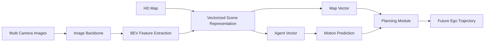

# VAD（Vectorized Autonomous Driving）模型研究

> 归档来源：王皓然 `whr` 分支。本文保留负责人原始调研和实验记录；本次第一阶段仓库整理未重新运行其中训练与推理，指标以原报告和后续正式实验附件为准。

负责人：王皓然
当前状态：基础资料整理完成；环境配置完成；nuScenes-mini 数据转换完成；VAD-Tiny 官方 checkpoint inference 已成功运行。

---

# 1. 调研目标

本调研面向“智能驾驶场景算法基础研究”方向，目标是分析 **VAD（Vectorized Autonomous Driving）** 是否适合作为自动驾驶规划与决策方向的 baseline 或技术参考。

本阶段结合 VAD 官方论文、代码仓库以及实际复现实验，重点分析：

* VAD 的整体架构设计；
* 向量化自动驾驶场景表示方法；
* 感知、预测、规划任务之间的关系；
* 与 CARLA / 仿真驾驶任务结合的可能性；
* 作为项目 baseline 的可行性。

---

# 2. 基本信息

| 项目         | 内容                                                                    |
| ---------- | --------------------------------------------------------------------- |
| 模型名称       | VAD（Vectorized Autonomous Driving）                                    |
| 论文标题       | VAD: Vectorized Scene Representation for Efficient Autonomous Driving |
| 论文链接       | [https://arxiv.org/abs/2303.12077](https://arxiv.org/abs/2303.12077)  |
| 官方仓库       | [https://github.com/hustvl/VAD](https://github.com/hustvl/VAD)        |
| 发布机构       | HUST-VL                                                               |
| 任务类型       | 自动驾驶感知、预测、规划、多任务决策                                                    |
| 核心思想       | 使用向量化场景表示统一建模车辆、地图、轨迹和规划任务                                            |
| 数据来源       | nuScenes                                                              |
| baseline方向 | BEV-based 自动驾驶规划模型                                                    |
| 主要应用       | 自动驾驶端到端感知与规划                                                          |

---

# 3. VAD 核心介绍

传统自动驾驶系统通常采用：

```
感知
 ↓
目标检测
 ↓
轨迹预测
 ↓
规划
 ↓
控制
```

的串联结构。

该结构存在：

* 模块之间信息传递损失；
* 感知结果难以直接用于规划；
* 预测和规划优化目标不一致。

VAD 提出：

> 使用 Vectorized Scene Representation（向量化场景表示）统一描述驾驶环境中的目标、地图元素以及运动轨迹，使模型能够直接完成场景理解、未来预测和规划任务。

VAD 并不是完全舍弃 BEV 特征，而是在 BEV 感知基础上进一步构建：

* Agent vector；
* Map vector；
* Trajectory vector。

形成更加结构化的驾驶场景表示。

---

# 4. VAD 与传统自动驾驶模型关系

| 模型        | 表示方式                  | 特点              |
| --------- | --------------------- | --------------- |
| BEVFormer | BEV feature           | 从多视角图像生成 BEV 表示 |
| PETR      | 3D query              | 学习三维空间关系        |
| UniAD     | BEV feature + 多任务     | 感知预测规划统一        |
| VAD       | Vector representation | 显式建模目标与地图关系     |

VAD 相比传统 BEV 方法：

优势：

* 场景表示更加紧凑；
* 保留道路和目标几何关系；
* 更适合 Transformer 建模；
* 输出更接近规划需求。

---

# 5. VAD 输入输出流程



---

## 输入：

* 多视角 camera images；
* HD Map；
* ego vehicle state；
* 历史轨迹信息；
* CAN bus 信息。

---

## 输出：

* 周围交通参与者未来轨迹；
* 道路结构预测；
* ego vehicle future trajectory。

---

# 6. VAD 核心模块分析

## 6.1 Vectorized Scene Representation

VAD 将驾驶环境表示为：

```
Scene
 |
 |-- Agent vectors
 |       |
 |       └── vehicles / pedestrians
 |
 |-- Map vectors
         |
         └── lanes / boundaries
```

相比传统 raster BEV：

优势：

* 数据结构更加紧凑；
* 避免大量无效空间计算；
* 保留显式几何信息；
* 更适合轨迹预测和规划。

---

# 6.2 Motion Prediction

VAD 对交通参与者未来运动进行预测。

输入：

```
agent history
+
scene context
```

输出：

```
future trajectories
```

作用：

* 判断潜在风险；
* 辅助规划决策；
* 提高驾驶安全性。

---

# 6.3 Planning Head

VAD 最终预测 ego vehicle 未来轨迹：

例如：

```
t0

(x1,y1)

(x2,y2)

...

(xN,yN)
```

输出未来多个时间点的位置，用于后续车辆控制。

---

# 7. 官方数据与格式

VAD 基于 nuScenes 数据集。

需要：

* 多摄像头图像；
* LiDAR；
* HD Map；
* CAN bus；
* ego 状态信息。

VAD 不直接使用 mmdetection3d 默认 annotation，需要生成：

```
vad_nuscenes_infos_temporal_train.pkl

vad_nuscenes_infos_temporal_val.pkl
```

转换命令：

```bash
python tools/data_converter/vad_nuscenes_converter.py \
nuscenes \
--root-path ./data/nuscenes \
--out-dir ./data/nuscenes \
--extra-tag vad_nuscenes \
--version v1.0-mini \
--canbus ./data
```

---

# 8. 官方 baseline 与运行流程

流程：

```
环境配置
 ↓
准备 nuScenes 数据
 ↓
准备 CAN bus
 ↓
生成 VAD annotation
 ↓
加载 checkpoint
 ↓
Inference
 ↓
Evaluation
```

---

# 9. 环境与算力需求

## 官方环境要求

| 项目            | 要求              |
| ------------- | --------------- |
| Python        | 3.7/3.8         |
| PyTorch       | 1.x             |
| CUDA          | 11.x            |
| MMCV          | 1.x             |
| MMDetection   | 2.x             |
| MMDetection3D | 0.17.x          |
| GPU           | NVIDIA CUDA GPU |

---

## 本次实验环境

| 项目            | 信息                       |
| ------------- | ------------------------ |
| 系统            | Windows 11 + WSL2 Ubuntu |
| GPU           | RTX4060 Laptop           |
| 显存            | 8GB                      |
| Python        | 3.7                      |
| PyTorch       | 1.9.1+cu111              |
| CUDA Runtime  | 11.1                     |
| MMCV          | 1.4.0                    |
| MMDetection   | 2.14.0                   |
| MMDetection3D | 0.17.1                   |
| 数据            | nuScenes v1.0-mini       |
| 模型            | VAD-Tiny                 |

---

## 训练可行性分析

完整训练 VAD 不适合当前设备：
（之后肯定要在服务器上跑）
原因：

* 官方训练采用多 GPU；
* nuScenes full 数据规模较大；
* 显存需求较高。

当前设备适合：

* mini 数据 inference；
* checkpoint 测试；
* 模型结构分析。

---

# 10. 实验记录

## 数据准备

成功完成：

* nuScenes-mini 解压；
* CAN bus 配置；
* map expansion 配置；
* annotation 转换。

生成：

```
vad_nuscenes_infos_temporal_train.pkl

vad_nuscenes_infos_temporal_val.pkl
```

数据规模：

| 数据          | 数量 |
| ----------- | -- |
| train scene | 8  |
| val scene   | 2  |
| val sample  | 81 |

---

# 11. Inference 实验结果

运行：

```bash
python tools/test.py \
projects/configs/VAD/VAD_tiny_stage_2.py \
ckpts/VAD_tiny.pth \
--eval bbox
```

---

## 推理速度

结果：

```
81 samples

6.3 task/s
```

RTX4060 Laptop 可以完成 VAD-Tiny 推理。

---

# 12. Motion Prediction结果

## Car

| 指标  | 结果      |
| --- | ------- |
| ADE | 0.931 m |
| FDE | 1.028 m |
| MR  | 0       |

---

## Pedestrian

| 指标  | 结果      |
| --- | ------- |
| ADE | 1.239 m |
| FDE | 1.627 m |
| MR  | 0.357   |

---

# 13. Planning结果

| 指标            | 结果      |
| ------------- | ------- |
| plan L2 @1s   | 1.417 m |
| plan L2 @2s   | 2.350 m |
| plan L2 @3s   | 3.322 m |
| collision @1s | 0       |
| collision @2s | 0       |
| collision @3s | 0.0097  |

实验说明：

* VAD-Tiny 可以完成基本轨迹规划任务；
* 短时间规划误差较低；
* 长时间预测误差增加。

---

# 14. 初步不足与风险

## 1. 不是真正闭环控制系统

VAD 输出：

```
future trajectory
```

不是：

```
steering
throttle
brake
```

因此仍需要：

* vehicle controller；
* PID；
* MPC 等控制方法。

---

## 2. 数据迁移成本

VAD 针对：

* nuScenes；
* 真实道路。

迁移到 CARLA 需要：

* sensor adaptation；
* 数据格式转换；
* annotation 构建。

---

## 3. 训练成本较高

完整复现论文结果需要：

* 多 GPU；
* nuScenes full；
* 长时间训练。

---

# 15. 对本项目的启发

## （1）向量化场景表示

可用于：

```
车辆
行人
车道
障碍物
```

统一表示。

---

## （2）预测辅助决策

参考：

```
预测其他车辆未来轨迹

↓

风险判断

↓

规划动作
```

---

## （3）规划模块设计

VAD 可以作为：

```
场景理解
+
轨迹预测
+
高层规划
```

模块参考。

---

# 16. 是否继续深入复现

当前判断：

建议继续作为 baseline 参考。

已完成：

环境配置
nuScenes-mini 数据准备
CAN bus 配置
annotation生成
checkpoint加载
inference运行

不建议：

* RTX4060重新训练；
* 下载完整 nuScenes 做训练。

下一步：

1. 分析 VAD 输出轨迹；
2. 尝试接入 CARLA；
3. 设计 VAD + LLM/VLM 语义决策模块。

---

# 17. 总结

本实验成功完成 VAD-Tiny 官方 baseline 最小复现。

验证结果：

* RTX4060 Laptop 可以运行 VAD-Tiny；
* nuScenes-mini inference 正常；
* 模型能够完成 motion prediction 与 planning。

VAD 更适合作为：

> 自动驾驶感知 + 预测 + 高层规划模型 baseline

而不是：

> CARLA 直接车辆控制 agent。

对于本项目，推荐：

```
CARLA环境

+

VAD风格场景表示

+

轨迹预测规划

+

车辆控制器

+

LLM/VLM解释模块
```

形成完整智能驾驶系统。

---

# 18. 参考资料

VAD Paper:

[https://arxiv.org/abs/2303.12077](https://arxiv.org/abs/2303.12077)

Official Repository:

[https://github.com/hustvl/VAD](https://github.com/hustvl/VAD)

nuScenes Dataset:

[https://www.nuscenes.org/](https://www.nuscenes.org/)

MMDetection3D:

[https://github.com/open-mmlab/mmdetection3d](https://github.com/open-mmlab/mmdetection3d)
