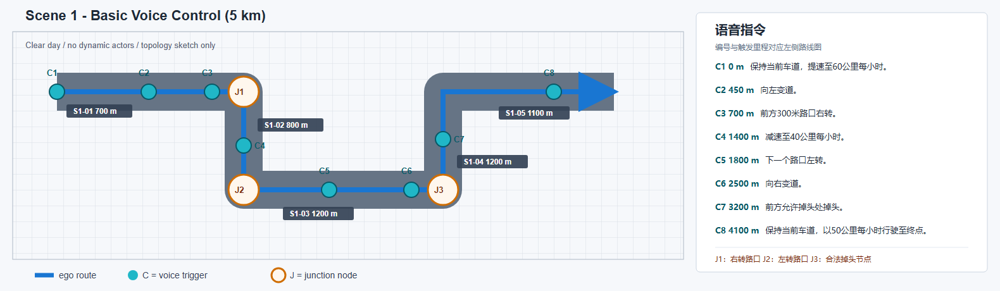
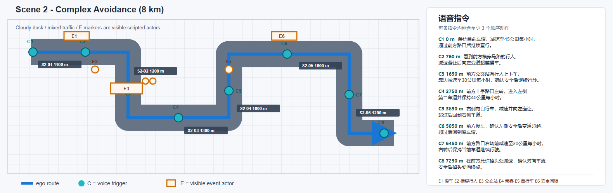
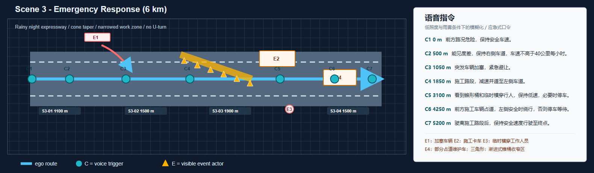

# 竞赛语音场景设计

本设计把每条赛道拆成两件必须同时成立的事：用户发出的语音指令，以及摄像头/雷达能看到、可支撑该指令执行的道路情境。不能先随机搭建风险事件，再在视频上补一条与画面无关的语音。

三份机器可读草案位于：

- `experiment/CARLA/configs/competition_voice_design/scene_1_basic_voice_5km.json`
- `experiment/CARLA/configs/competition_voice_design/scene_2_complex_avoidance_8km.json`
- `experiment/CARLA/configs/competition_voice_design/scene_3_emergency_6km.json`

它们的 `design_status` 均为 `design_only`，尚未接入 `run_control_experiment.py`。字段刻意与 `DrivingIntent 1.1.0` 的 `category`、`action`、方向、速度、触发条件和完成条件对齐，后续接入时不应再另造一套语义命名。

## 路线示意、口令与路段长度

下图是方格纸式的拓扑草图，用于核对“口令、道路节点和特殊 actor 的位置关系”。图内只保留触发编号：`C` 为语音触发点，`J` 为路口/掉头节点，`E` 为可见事件 actor 或区域；完整中文语音在图右侧列出。它们不代表精确地图坐标；实现阶段仍需将每个节点绑定到满足要求的 CARLA waypoint、信号相位和出生点。

### 场景 1：基础语音操控，5 km

| 路段 | 里程区间 | 长度 | 道路与演示目的 |
| --- | --- | ---: | --- |
| S1-01 | 0--700 m | 700 m | 东向三车道主干道；完成提速与左变道。 |
| S1-02 | 700--1500 m | 800 m | J1 右转后进入南向主干道；演示“300 m 后右转”和减速。 |
| S1-03 | 1500--2700 m | 1200 m | J2 左转后进入东向主干道；演示左转和右变道。 |
| S1-04 | 2700--3900 m | 1200 m | J3 合法掉头节点及其前后预告距离；演示掉头。 |
| S1-05 | 3900--5000 m | 1100 m | 返回主干道；稳定巡航至终点。 |

### 场景 2：复杂避障语音操控，8 km

| 路段 | 里程区间 | 长度 | 道路与演示目的 |
| --- | --- | ---: | --- |
| S2-01 | 0--1100 m | 1100 m | 次干道、路口与横道；C1 直行，C2 行人让行后超越慢车。 |
| S2-02 | 1100--2300 m | 1200 m | 路侧公交站和非机动车道；C3 演示上下车乘客避让。 |
| S2-03 | 2300--3600 m | 1300 m | 十字路口及左转出口；C4 演示左转、车道选择和速度约束。 |
| S2-04 | 3600--5200 m | 1600 m | 商业混合交通路段；C5 避让自行车，C6 条件超越慢车并返回原车道。 |
| S2-05 | 5200--6800 m | 1600 m | 信号路口与公交走廊；C7 右转前减速、右转后直行。 |
| S2-06 | 6800--8000 m | 1200 m | 右转后连接合法掉头口；C8 对向安全确认后掉头至终点。 |

### 场景 3：极限应急语音操控，6 km

| 路段 | 里程区间 | 长度 | 道路与演示目的 |
| --- | --- | ---: | --- |
| S3-01 | 0--1100 m | 1100 m | 雨夜三车道快速路；C1 模糊安全车速，C2 能见度限速，C3 可恢复加塞。 |
| S3-02 | 1100--2600 m | 1500 m | 施工预告、闪灯和渐进式锥桶；C4 减速并道至左侧。 |
| S3-03 | 2600--4500 m | 1900 m | 收窄施工区；C5 临时横穿人员，C6 维护车阻道与安全间隙。 |
| S3-04 | 4500--6000 m | 1500 m | 施工结束与正常车道恢复；C7 安全驶向终点。 |

## 设计原则

1. **口令先行。** 每个可见事件都绑定到至少一条语音指令；每条语音指令在执行窗口前必须有足够的视觉预告。
2. **指令和成功分离。** 指令定义用户意图；场景定义客观完成、碰撞、违规和超时。模型不能自行把“已经输出动作”当成成功。
3. **按赛道递进。** 场景 1 不放动态干扰；场景 2 的风险在动作前可见并允许安全间隙；场景 3 的突发风险可恢复但不保证舒适。
4. **可测量而非只可演示。** 单条路线中的口令数量用于展示，不足以证明 95% 或 98% 指标。每个模板必须另有带同义表达、口语表达和噪声条件的离线评测集。
5. **路线是有向图。** 左转、右转、变道和掉头必须绑定到实际可通行的 waypoint 节点。只有场景 1、2 预留合法掉头点；快速路场景 3 明确禁止掉头。

## 场景 1：基础语音操控，5 km

在线演示放置 8 条单步基础口令：设定 60 km/h、向左变道、300 m 后右转、减速至 40 km/h、左转、向右变道、合法掉头、设定 50 km/h 至终点。每条口令只含一个主动作；“保持当前车道”作为速度动作的约束，而不是额外的风险任务。

路线采用三段主干道与三个路口：右转节点、左转节点和合法掉头节点。全程没有背景交通、行人、锥桶或特殊 actor，保证考核的是基础指令理解和动作稳定性。

建议另建 160 条离线语料：8 个语义模板各 20 个同义口语表达。5 km 线上演示只报告动作完成和延迟；识别准确率与语义对齐率必须在独立语料上统计。

## 场景 2：复杂避障语音操控，8 km

在线演示放置 8 条组合口令，每条均至少含三个可顺序验证的动作。竞赛方案列出的两条示例原文被直接采用：行人横穿时的“减速避让后向左变道超越慢车”，以及公交站的“靠边减速至30公里每小时，确认安全后继续行驶”。关键顺序必须可从日志判定：行人场景应严格表现为让行/降速、行人清空、出现安全间隙、变道、超过慢车，不能跳过中间步骤。

路线依次经过横道、公交站、十字路口、非机动车路段、慢车路段和合法掉头节点。背景流由私家车、公交车、自行车和人行道行人组成。公交站事件不依赖 CARLA 车门动画：应使用静止公交车、站牌和上下车行人的运动轨迹共同表达“乘客上下车”，并将这些 actor 明确写入事件日志。

建议为 8 条模板各准备至少 12 种表达，额外检查组合步骤的顺序召回率、目标对象、方向、速度和 `on_blocked` 策略。只报整句正确率会掩盖“漏掉减速”或“把左变道解析成右变道”等关键错误。

## 场景 3：极限应急语音操控，6 km

在线演示放置 7 条低照度、雨雾和应急口令。第一条“保持安全车速”刻意不指定数字：解析器只能输出减速与安全优先级，具体 35--45 km/h 由风险策略结合湿滑、能见度和前车关系决定。这样才能体现语义解析、环境理解和决策的分工。

施工区不应在单帧突然出现完整锥桶墙。推荐顺序为：预告标志和闪灯、逐渐收窄的锥桶锥形区、封闭车道内的施工车、窄车道、临时横穿工作人员、部分占道的维护车、施工结束标志。每个 actor 的出现距离和可见性要求都已写入 JSON 草案。

紧急加塞和临时横穿行人必须在理论制动距离之外触发，留出可恢复的安全动作空间；“无法避免的碰撞”不能用于评价策略。维护车事件则先让左侧不可安全变道，随后释放间隙，用于验证“否则停车等待”的条件分支。

建议每个模板至少 10 种表达，并在干净语音和三档受控噪声下重复。应分别统计语音识别、应急语义对齐、从危险可见到动作输出的延迟、决策超时次数和安全结果。

## 后续实现顺序

1. 为三份 JSON 选定满足拓扑要求的具体地图 waypoint，并保存路线节点、信号灯相位和 actor 出生点。
2. 扩展连续场景管理器，使其支持 `bus_stop_passengers`、`cyclist_pass`、`cone_taper`、`work_zone`、`conditional_gap` 等事件。
3. 让事件日志记录“可见时刻、语音到达时刻、解析完成时刻、策略输出时刻、动作开始时刻、动作完成时刻”。
4. 将语音计划从临时 `VoiceSchedulePolicy` 改为外部 `DrivingIntent` 输入；临时策略只可用于场景调试。
5. 在每条完整路线稳定后，再建立独立语料和重复运行协议，计算比赛要求的准确率和延迟指标。
