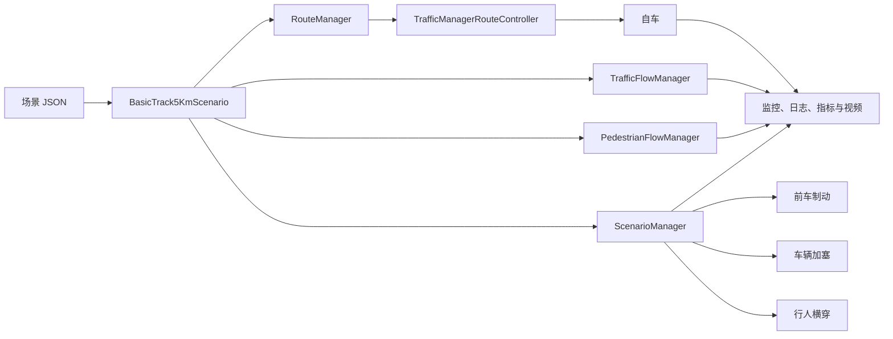

# CARLA 自动驾驶场景仿真平台

本目录是项目的 CARLA 仿真、控制适配、日志、评测和视频证据层。当前重点是一个配置化的 `basic_track_5km` 连续场景：在同一辆自车、同一条路线中持续生成交通流与行人，并按路线进度触发可控风险事件。

该实现用于验证场景构建和评测闭环。当前自车仍使用临时路线跟随策略，不能表述为已完成的语音、视觉或 VLA 决策成果。

## 功能特点

- 配置化构建 5 km 连续路线、天气、背景交通、路侧行人和特殊事件。
- 以路线进度为统一时钟，在同一辆自车周围调度多个事件。
- 使用 CARLA Traffic Manager 生成可复现的常规车辆交通流。
- 提供前车制动、车辆加塞、行人横穿三类独立事件 actor。
- 统一输出 `RUNNING`、`SUCCESS`、`FAILURE` 状态与可解释原因。
- 保存逐帧记录、事件记录、实时状态、指标汇总和带 HUD 的视频。
- 支持从指定路线进度恢复，便于长路线分段录制和故障定位。

## 当前支持场景

| 场景 | 作用 | 当前状态 |
| --- | --- | --- |
| `straight_driving` | 短距离直行与横向偏移验证。 | 原子场景。 |
| `emergency_brake` | 前车制动后的自车安全制动验证。 | 原子场景。 |
| `pedestrian_crossing` | 行人横穿后的自车安全验证。 | 原子场景。 |
| `basic_voice_control_5km` | 基础指令调度与路线几何验证。 | 临时规则/语音日程演示。 |
| `basic_track_5km` | 带交通流、行人流和三类事件的 5 km 连续场景。 | 当前主场景。 |

## 系统架构

### Scenario（场景模块）

`scenarios/continuous/basic_track_5km.py` 是连续场景入口。它选择满足车道数量要求的出生点，生成 5 km waypoint 路线，创建自车、交通流、行人流和 `ScenarioManager`，并在每个仿真 tick 更新路线进度和 actor 状态。

特殊事件必须复用全局自车，只创建、更新和销毁自身的 NPC 或障碍 actor；不能为某一个小事件再生成另一辆自车。

### RouteManager（路线模块）

`continuous/route_manager.py` 负责：

- 从地图 waypoint 生成固定间隔的连续路线。
- 根据自车位置在前向窗口中寻找最近路线点，更新全局路线进度。
- 提供前视目标点与末端判断。
- 使用 `seek(progress_m)` 从保存的全局距离恢复，供分段录制使用。

路线进度是交通补充、事件触发、日志和成功判定共同使用的唯一距离基准。

### Traffic、Pedestrian 与事件模块

`continuous/traffic.py` 管理常规交通车、临时自车路线跟随和路侧行人流。`continuous/events.py` 管理确定性风险事件。`continuous/scenario_manager.py` 根据路线进度激活事件，收集状态细节并在结束后销毁 actor。

### Evaluation（评测模块）

`evaluation/` 负责碰撞、车道侵入、逐帧日志、指标汇总、相机 HUD 和视频。场景自身提供任务目标与终态，评测层记录这些事实，不由策略模块自行宣布成功。

## 后续规划

- 将真实语音、指令解析、视觉感知、语义对齐和风险决策接入同一条 CARLA 运行链路。
- 使用相机或点云而不是 CARLA 世界真值驱动策略，并保存模型输入与对齐结果。
- 扩展至组合指令、路口、静态障碍、复杂天气、施工路段和 6--8 km 场景。
- 补齐比赛所需的识别准确率、语义对齐率与端到端延迟独立测量。

# 7.20更新

## CARLA 场景框架功能完善

### 更新概述

连续场景以 `configs/basic_track_5km_demo.json` 为参数来源。当前场景使用 `Town04_Opt` 的晴天城市主干道路线，目标长度为 5000 m，路线间隔为 5 m，自车临时目标速度为 45 km/h。

场景配置把路线、交通流、行人流和事件时序分开描述。修改 JSON 即可调整出生距离、车道、速度、人数、补充间隔和事件超时，无需更改事件实现代码。

# 1. 场景状态统一管理

所有场景使用统一状态：

- `RUNNING`：场景仍在进行。
- `SUCCESS`：任务目标已经客观满足。
- `FAILURE`：出现碰撞、违规、事件失败或其他终止条件。

`basic_track_5km` 的成功条件必须同时满足：

1. 自车到达路线末端 20 m 容差内。
2. 没有碰撞。
3. 没有非法压线。
4. 所有已配置事件都已 `COMPLETED`。

发生碰撞或跨越实线、双实线、路缘等非法标线会立即失败。若路线已经结束但仍有 `PENDING`、`ACTIVE` 或 `FAILED` 事件，也会失败，避免只因到达终点就误判成功。

# 2. 场景任务目标定义

## 2.1 StraightDrivingScenario

### 任务目标

自车沿预设直线路线到达指定目标位置。

### 成功条件

自车距离目标不超过 3 m，且横向偏移不超过 1 m。

### 失败条件

发生碰撞或超时。

## 2.2 EmergencyBrakeScenario

### 任务目标

模拟前车制动后，自车实施安全制动。

### 成功条件

前车制动已触发；自车速度不超过 0.5 km/h 并持续 1 s；停车后与前车距离至少 5 m。

### 失败条件

发生碰撞、超时或停车间距不安全。

## 2.3 PedestrianCrossingScenario

### 任务目标

模拟行人横穿后，自车安全通过冲突区域。

### 成功条件

行人完成横穿并在最小人车距离后持续远离，且自车未发生碰撞。

### 失败条件

发生碰撞或超时。

## 2.4 BasicTrack5KmScenario

### 任务目标

在一条 5 km 连续路线中保持持续交通流和行人可见，按距离触发前车制动、车辆加塞和行人横穿，并输出完整的评测证据。

### 事件时间线

| 路线进度 | 事件 | 当前参数 | 完成判定 |
| ---: | --- | --- | --- |
| 420 m | `lead_brake_001` | 同车道前方约 65 m 生成车辆；先行驶 3 s，再全制动 3 s。 | 制动保持结束；actor 消失则失败。 |
| 900 m | `cut_in_001` | 左侧相邻车道前方约 62 m 生成车辆，以 35 km/h 行驶；2.5 s 后向自车车道合流。 | 实际进入目标车道并保持 2 s；超时失败。 |
| 1350 m | `pedestrian_crossing_001` | 右侧路边前方约 55 m 生成行人，以 1.35 m/s 横向通过 12 m。 | 到达横穿距离并保持 2 s；15 s 超时失败。 |

### 成功条件

完成整条路线、无碰撞、无非法压线，且三个事件均成功结束。

### 失败条件

发生碰撞、非法压线、任一事件失败，或路线结束时仍有未完成事件。

# 3. 运行状态实时获取

`scenario.get_status()` 返回当前状态、结束原因、路线进度、交通/行人 actor 数量、碰撞和压线计数，以及每个特殊事件的 `PENDING`、`ACTIVE`、`COMPLETED`、`FAILED` 状态。

加塞事件额外记录源车道、目标车道、当前车道和观察到合流完成的时间；行人横穿事件记录实际横移距离与清空时间。实时快照每 10 帧写入 `runtime_status.json`，可在运行中读取。

# 4. Actor 管理与编号记录

场景明确区分以下 actor：

- `ego`：全程唯一的自车。
- `background_traffic` 与 `route_traffic`：普通交通流车辆。
- `controlled_brake_vehicle`：前车制动事件车辆。
- `controlled_cut_in_vehicle`：加塞事件车辆。
- 路侧行人和横穿事件行人。

`ScenarioManager` 只持有活跃特殊事件；事件结束时销毁对应 actor。交通流和行人流由各自 manager 统一销毁，避免长路线中遗留无主 actor。

# 5. NPC 行为逻辑

## 5.1 一般交通车辆

一般车辆由 `TrafficFlowManager` 按自车前方路线点生成，并交给 CARLA Traffic Manager：

- 初始生成 9 辆路线交通和 3 辆随机背景交通。
- 路线交通依次放在前方 35--260 m 的同向相邻车道。
- 期望速度为 55 km/h，并加入 -4、0、+4 km/h 的确定性差异。
- 全局跟车距离为 5 m。
- 每前进 180 m 补充车辆，活跃数量上限为 24 辆。

生成位置、车型、颜色、速度和补充时机由本项目控制；微观跟车、常规制动和道路行驶由 CARLA Traffic Manager 处理，而不是逐帧硬编码油门、制动和转向。

## 5.2 路侧行人

`PedestrianFlowManager` 在路线前方 22--160 m 的路侧生成行人，之后每 180 m 补充。行人速度为 1.2、1.3 或 1.4 m/s，交替沿道路前后方向行走。

当前采用 `kinematic` 运动：每 tick 发送 `WalkerControl` 并显式更新位置；走满 40 m 后反向。此方式使不同路段的行人持续可见，并降低导航网格差异导致行人停滞的概率。活跃行人总数上限为 18 名。

## 5.3 前车制动

前车制动不是背景车的随机行为。`AdjacentLeadBrakeEvent` 每 tick 直接调用 `apply_control`：先使用固定油门，再使用 `brake=1.0`。这样制动时刻和持续时间可复现，是可观察的风险触发源。

## 5.4 车辆加塞

`CutInVehicleEvent` 先由 Traffic Manager 保持期望速度，同时关闭随机自动变道。到达预设时间后调用 `force_lane_change`，再通过地图 waypoint 检查 actor 的实际 `road_id` 和 `lane_id` 是否已经与目标车道一致。只有真正完成合流并保持规定时间才成功。

## 5.5 行人横穿

`PedestrianCrossingEvent` 根据道路朝向计算横穿方向。`kinematic` 模式下，行人按速度乘以仿真时间显式横移；到达横穿距离后进入 `CLEARED`，保持规定时间后才变为 `COMPLETED`。

# 6. 碰撞检测功能

碰撞和车道侵入由 `evaluation/events.py` 监控，并写入每帧日志。原始车道侵入会完整保留；只有实线、双实线或路缘等明确非法标记计入 `illegal_lane_invasion_count`。这避免虚线、边界噪声或传感器重复触发直接判定失败。

# 7. Ego 外部控制支持

控制层可接收扁平控制 JSON 或 `DrivingIntent`。无效、缺失或不受支持的外部控制会安全映射为 `stop`，不会继续使用过期动作。

`basic_track_5km` 当前使用 `TrafficManagerRouteController` 和固定 `keep_lane` 策略完成路线跟随；它的作用是稳定地验证场景和评测接口。后续应在不改变日志和终态接口的前提下，用语音、指令解析、感知和风险决策模块替换该临时策略。

# 8. 场景结束日志输出

每次运行的输出目录包含：

| 文件 | 内容 |
| --- | --- |
| `run_manifest.json` | 场景、控制器、传感器与运行参数快照。 |
| `frames.jsonl` | 每个 tick 的动作、控制量、自车状态、事件计数、场景状态和耗时。 |
| `events.jsonl` | 事件激活、完成、失败、交通流变化和最终汇总。 |
| `runtime_status.json` | 定期刷新的实时状态快照。 |
| `metrics.json` / `metrics.csv` | 距离、速度、碰撞、压线、超速、完成度和延迟统计。 |
| `scenario_config.resolved.json` | 使用路线恢复时写出的实际场景参数副本。 |
| 视频或帧图像 | HUD 中显示状态、路线进度、交通数量、速度、控制量和事件。 |

HUD 使用黄色表示 `RUNNING`、绿色表示 `SUCCESS`、红色表示 `FAILURE` 或紧急制动。视频末尾应保留终态画面，使路线完成、碰撞和违规结果可以直接核验。

检查点恢复会把恢复进度之前的事件记为 `resumed_completed`，不会在该片段重新播放。因此分段视频用于演示与定位；正式任务结果应以从 0 m 起完整运行的 `scenario_status` 为准。

## 回归验证范围

当前测试覆盖路线进度、检查点恢复、事件只触发一次、共享自车、指标完成语义、减速不误报超速，以及原始压线与非法压线的区分。它们验证场景调度和评测语义，不替代真实 VLA、视觉感知或比赛指标验证。
