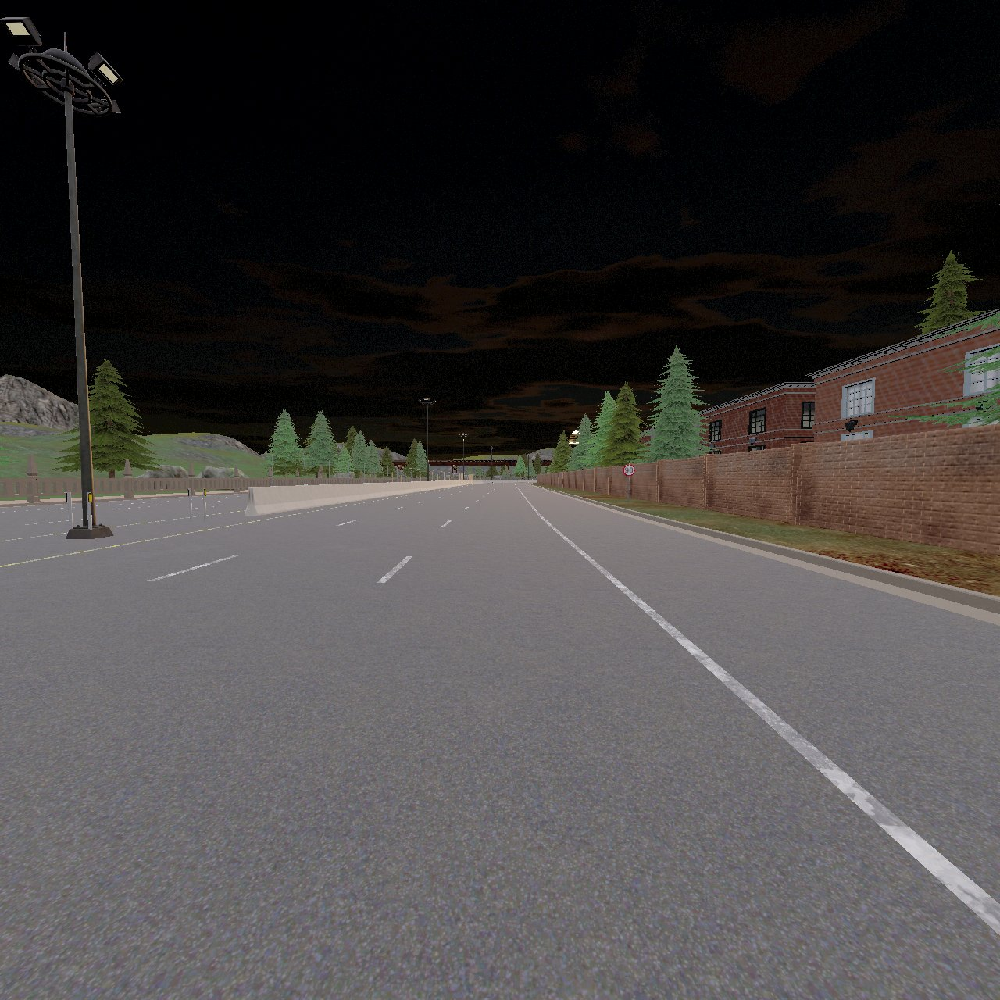
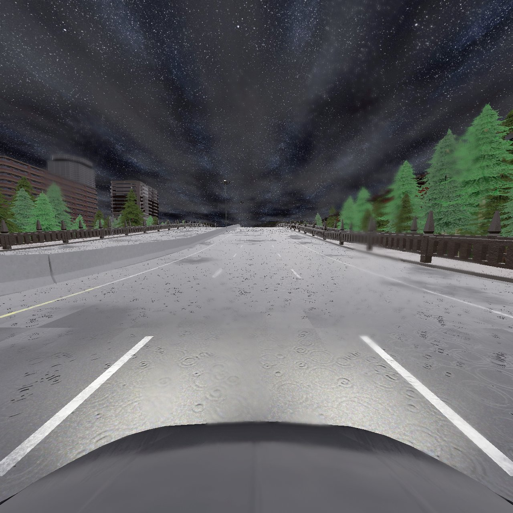

# 场景 2、3 未持续起步：决策证据与原因分析

本目录汇总 `challenge-track` 链路在两次短程测试中的起步故障。结论仅针对本次记录的 200 帧和 400 帧，不代表完整场景的驾驶能力。

## 文件

| 文件 | 内容 |
| --- | --- |
| `scene2_decision_trace.jsonl` | 场景 2 连续 200 帧的精简决策链。 |
| `scene3_decision_trace.jsonl` | 场景 3 连续 400 帧的精简决策链。 |
| `run_summary.json` | 帧数、模型提案、最终动作、风险和里程统计。 |
| `scene2_start_front.jpg`、`scene3_start_front.jpg` | 起步附近的前视抽样画面，用于展示场景，不作为全程无障碍的证明。 |

精简日志保留了输入模态状态、传感器帧号、VLA 提案、模型风险、融合风险、计划状态、最终决策和上一物理步的实际速度/油门/刹车。未包含原始多视角图像序列、LiDAR 点云、雷达二进制或视频。图像为抽样帧，不能仅凭画面判定触发风险的精确帧没有障碍。两次运行的 `policy_truth_access` 均为 `false`；对应字段可逐帧核查。

## 场景 2：一次高风险使计划进入终止阻塞

- 运行 `scene2_smoke_003`：200 个决策帧，最终沿路线前进约 0.40 m。VLA 提案为 `accelerate` 199 次、`keep_lane` 1 次；最终决策却是 `accelerate` 14 次、`stop` 186 次。
- 第 14 个决策帧，即仿真帧 **426196**：模型风险突然为 `high`，高风险概率约 **0.748**，原因码为 `learned_visual_risk_high`。当帧计划中的首步 `KEEP_LANE` 被标记为 `BLOCKED`，原因码 `risk_requires_emergency_brake`，最终动作转为 `stop`。
- 从仿真帧 **426197** 到结束：风险返回 `low`，VLA 提案恢复为 `accelerate`，但 `plan_status` 持续为 `BLOCKED`，最终决策始终为 `stop`、原因为 `active_plan_not_ready`。末帧仿真帧 **426381** 的实际速度为 0 km/h。
- 代码路径：`scene_understanding/src/control_plan_executor.py` 的阻塞策略将当前步骤写入终止 `BLOCKED` 状态，后续 `advance_control_plan` 对该状态持续输出停车；`lightweight_vla_adapter/src/driving_plan_runtime.py` 的 `enforce_execution` 再禁止后续提案绕过计划状态。**持续停车的直接原因是计划状态没有恢复或重新建计划，而不是 VLA 持续要求停车。**

单帧 `high` 的成因尚未确定。起步截图道路看似通畅，但不是仿真帧 426196 的逐像素证据，不能仅凭截图断言模型误报。建议先核查该帧视觉风险输入和高风险概率；即使该风险真实，解除风险后也应有明确、安全的重评估或重新建计划路径，而非无限期保持终止阻塞。

## 场景 3：近地雷达回波进入风险门，提案也趋于停车

- 运行 `scene3_smoke_003`：400 个决策帧，最终沿路线前进约 1.42 m。模型原始视觉风险 400 帧均为 `low`；融合后 395 帧为 `medium`，原因码均是 `physical_forward_radar_caution_distance`。
- 从仿真帧 **318147** 起，前向雷达在约 12 m 的谨慎距离内持续给出近距回波，最终控制从 `accelerate` 改为 `decelerate`；395 帧的 `model_output_applied` 为 `false`。
- VLA 提案本身有 **382/400 帧为 `stop`**，首个出现在仿真帧 **318150**。最终决策中 `unconfirmed_stop_crawl_floor` 出现 382 次。因此，**只修正雷达误判尚不能保证恢复巡航**，还需单独排查模型/时序决策为何持续提议停车。提案在同帧雷达风险融合之前生成，但是否受先前状态间接影响，需要进一步隔离验证。
- 对仿真帧 318192、318242、318342、318541 所消费的上一帧雷达原始回波做过离线几何复核：被选中的最近回波为约 10.55–10.60 m，相对雷达高度约 **-0.64 m**，世界高度约 **0.43 m**，与附近 LiDAR 路面点的高度相近，位置长期稳定。记录里的 `forward_radar.sensor_frame` 比决策仿真帧早一帧，复核时按该传感器帧匹配。
- 代码路径：`experiment/CARLA/carla_multiview_sensor.py` 的雷达过滤条件为 `relative_height_m >= -0.65`，这些约 `-0.64 m` 的近地回波恰好通过；`experiment/CARLA/universal_vla_controller.py` 的 `fuse_forward_radar_risk` 随后把 12 m 内回波提升为中风险。现有证据强烈支持**路面或近地静态碰撞几何被当作障碍**，而非雨水随机回波；雷达记录本身没有目标物体类别，不能仅凭该记录确定具体是哪一个碰撞网格。

建议先在回放中校准路面高度并复核真实障碍的雷达/视觉/LiDAR一致性，再检查风险门是否仍把近地回波覆盖为障碍。另需单独记录未经后置风险门改写的 VLA 提案及其时序输入，比较剔除这类路面回波前后的停车提案比例；不要直接关闭所有近距安全约束。

## 阅读顺序

1. 查看两张起步画面，确认测试时的视觉场景。
2. 查看 `run_summary.json` 的提案与最终动作计数。
3. 在 `scene2_decision_trace.jsonl` 中定位帧 `426196`、`426197` 和 `426381`；在 `scene3_decision_trace.jsonl` 中定位帧 `318147`、`318150`、`318192` 和 `318541`。

日志中的 `previous_step_feedback` 是当前决策发出前一个物理步的执行反馈，不能误当作当前决策执行后的即时结果。
